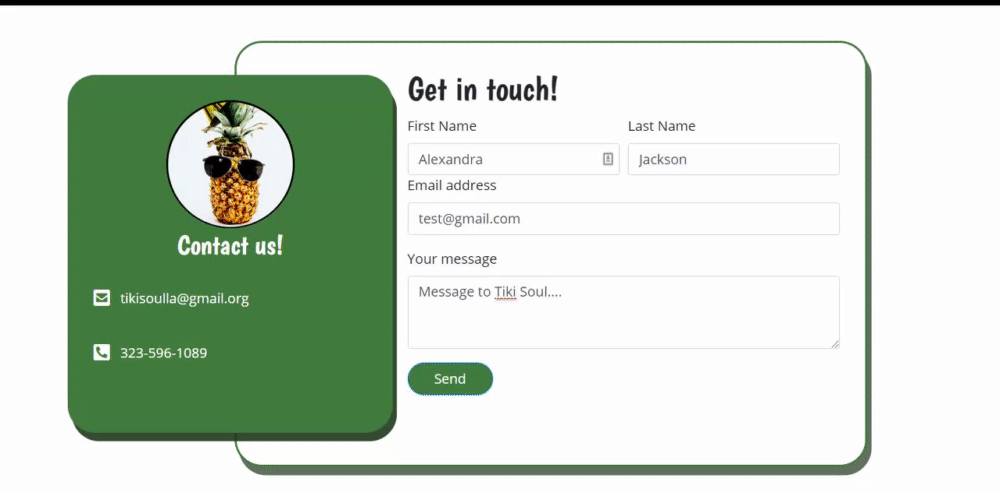

# food-truck-project1
This is a team project for the UCLA Coding Bootcamp Fall 2019 cohort.

## Description
This web application is a site designed for a client that runs their own food truck business. On this site, users can view a live map of where the food truck will be, view the menu, view a gallery of offerings, and contact the owners of the food truck. This site is designed to be responsive and mobile-friendly.

## Features
All - All pages feature a responsive navigation bar that toggles to a hamburger icon at specified screen widths. 

Home Page - This page includes a Google Maps API that updates depending on the day to display the location of the food truck. If there is no service on the day a user visits the site, an image displays to let them know that there is no service in place of the map.

Menu Page - This page displays the current menu for the food truck.

Contact Page - This page features a form that will send the submission directly to the form owner's e-mail and also inputs the data sent into a Google Sheets document. Content entered into the form but not yet submitted is saved in local storage for ten minutes. After ten minutes the content clears. This is so that if a user begins to input into the form but navigates away from the site, they can return to the form and complete their submission without having to enter it in again. When they submit the form successfully, an image appears in place of the form to confirm the submission.

Gallery Page - This page features images of the items from the menu; when a user hovers over the image, the name of the dish is displayed.

## Installation
This site can be accessed via the deployed page.

## Usage
[Deployed Site](https://alexandramj92.github.io/food-truck-project1/index.html)

[GitHub Repo](https://github.com/alexandramj92/food-truck-project1)

## Authors
[Alexandra Jackson](https://github.com/alexandramj92)
[Juan Elias](https://github.com/YesIsMeJC)
[Stephanie Aurelio](https://github.com/stephmarie17)
[Taylor Allen](https://github.com/taylorallen02)

## Project status
The authors currently have plans to incorporate greater functionality to the site, such as an order from for users to place orders in advance. We are also temporarily hosting the deployed site here until the client deploys to their own domain.
